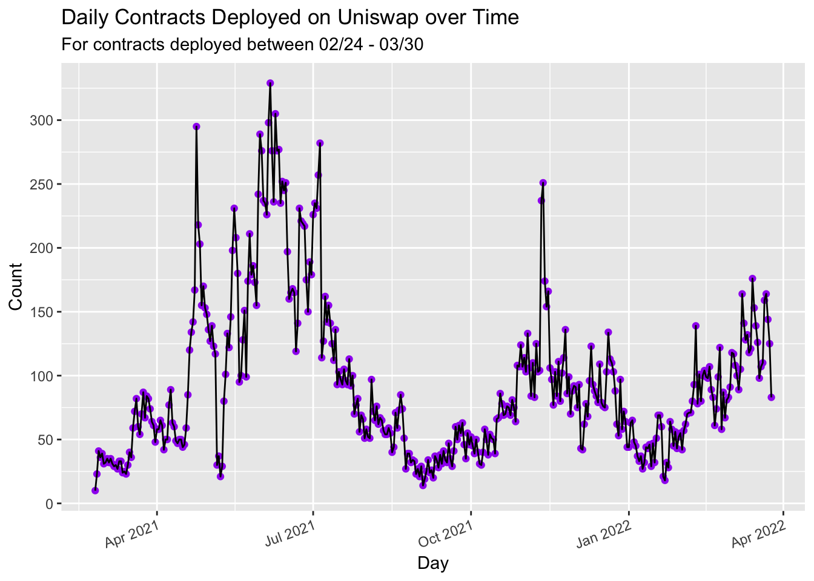

<h1 class="title toc-ignore">Uniswap Report Walkthrough</h1>
<h4 class="author">Omni Analytics Group</h4>
<h4 class="date">4/4/2022</h4>

<h2>Introduction</h2>

This brief README/tutorial will walk you through the process we took
in order to produce the individual Uniswap Report Plots, and ultimately
the final report! To produce this report, you need a recent version of
R, as well as the following R packages:

<pre class="r"><code>## Load Libraries
library(tidyverse)
library(lubridate)
library(patchwork)
library(grid)
library(ggnetwork)
library(scales)
library(magick)</code></pre>

We also recommend the use of RStudio as your R IDE, as this will ease
the process of debugging any coding issues and saving the state of your
R session. Once R, RStudio, and the above packages are installed, we’re
ready to begin!

<h2>Data</h2>

The very first step is to process the raw data and ensure it is
suitable for the analysis. The data is provided as RDS files, which is
an R binary storage format that can be directly read into your session
via the <code>readRDS()</code> call:

<pre class="r"><code>## Load Uniswap Pair Info Dataset
uni &lt;- readRDS(&quot;pairs_info.rds&quot;) %&gt;%
    as_tibble() %&gt;%
    mutate(across(where(is.character), readr:::parse_guess))</code></pre>

There is one extreme outlier in the data (<code>LAWA</code>) that we
will remove in order to ensure that the remaining results are
interpretable:

<pre class="r"><code>## Remove Outlier
uni &lt;- uni[!(uni$Pr_Token1_Ticker %in% c(&quot;LAWA&quot;)),]
uni &lt;- uni[!(uni$Pr_Token0_Ticker %in% c(&quot;LAWA&quot;)),]</code></pre>

Next, we do a little pre-processing of the dates so that we can track
the date and time at which the report was generated:

<pre class="r"><code>## Get the day of infographic and split data set to the new one
current_time &lt;- Sys.time()-hours(1)
attr(current_time,&quot;tzone&quot;) &lt;- &quot;GMT&quot;
current_date &lt;- as_date(current_time)
uni$Pr_Date &lt;- as_date(uni$Pr_Created)
new &lt;- uni[uni$Pr_Date == current_date,]
uni &lt;- uni[uni$Pr_Date &lt;= current_date,]</code></pre>

We are now ready to begin with the analysis!

<h2>Aggregate Metrics</h2>

We next produce the code required to produce a handful of important
metrics:

<ul>
<li>Average daily contracts deployed</li>
</ul>
<pre class="r"><code>avg_cont &lt;- uni %&gt;%
    mutate(Date = as_date(Pr_Created)) %&gt;%
    group_by(Day = day(Date), Month = month(Date), Year = year(Date)) %&gt;%
    summarise(Count = n()) %&gt;%
    ungroup() %&gt;%
    summarise(`Average Daily Count` = mean(Count)) %&gt;%
    pull(`Average Daily Count`)

avg_cont</code></pre>
<pre><code>## [1] 94.28861</code></pre>
<ul>
<li>Average amount of liquidity</li>
</ul>
<pre class="r"><code>avg_liq &lt;- uni %&gt;%
    summarise(`Average Liquidity` = mean(Pr_Liquidity_USD)) %&gt;%
    pull(`Average Liquidity`)

avg_liq</code></pre>
<pre><code>## [1] 257845.9</code></pre>
<ul>
<li>Median amount of liquidity</li>
</ul>
<pre class="r"><code>med_liq &lt;- uni %&gt;%
    summarise(`Average Liquidity` = median(Pr_Liquidity_USD)) %&gt;%
    pull(`Average Liquidity`)

med_liq</code></pre>
<pre><code>## [1] 20656.6</code></pre>
<ul>
<li>Average daily liquidity</li>
</ul>
<pre class="r"><code>daily_liq &lt;- uni %&gt;%
    mutate(Date = as_date(Pr_Created)) %&gt;%
    group_by(Day = day(Date), Month = month(Date), Year = year(Date)) %&gt;%
    summarise(Liq = sum(Pr_Liquidity_USD)) %&gt;%
    ungroup() %&gt;%
    summarise(`Average Daily Liquidity` = mean(Liq)) %&gt;%
    pull(`Average Daily Liquidity`)

daily_liq</code></pre>
<pre><code>## [1] 24311935</code></pre>
<ul>
<li>Median daily liquidity</li>
</ul>
<pre class="r"><code>daily_liq_med &lt;- uni %&gt;%
    mutate(Date = as_date(Pr_Created)) %&gt;%
    group_by(Day = day(Date), Month = month(Date), Year = year(Date)) %&gt;%
    summarise(Liq = sum(Pr_Liquidity_USD)) %&gt;%
    ungroup() %&gt;%
    summarise(`Average Daily Liquidity` = median(Liq)) %&gt;%
    pull(`Average Daily Liquidity`)

daily_liq_med</code></pre>
<pre><code>## [1] 7979155</code></pre>

Finally, to prepare for the visualization stage, we produce some
pairs datasets:

<pre class="r"><code>v1 &lt;- uni %&gt;%
    select(Pr_Token0_Reserve, Pr_Token0_Ticker) %&gt;%
    filter(!(Pr_Token0_Ticker %in% c(&quot;WETH&quot;, &quot;ETH&quot;, &quot;WBTC&quot;, &quot;renBTC&quot;, &quot;USDC&quot;, &quot;USDT&quot;, &quot;DAI&quot;, &quot;USDN&quot;)))

v2 &lt;- uni %&gt;%
    select(Pr_Token1_Reserve, Pr_Token1_Ticker) %&gt;%
    filter(!(Pr_Token1_Ticker %in% c(&quot;WETH&quot;, &quot;ETH&quot;, &quot;WBTC&quot;, &quot;renBTC&quot;, &quot;USDC&quot;, &quot;USDT&quot;, &quot;DAI&quot;, &quot;USDN&quot;)))

v3 &lt;- v1 %&gt;%
    rename(reserve = Pr_Token0_Reserve, ticker = Pr_Token0_Ticker) %&gt;%
    bind_rows(v2 %&gt;% rename(ticker = Pr_Token1_Ticker, reserve = Pr_Token1_Reserve))</code></pre>

And now, we are ready for the exciting part. The plots!

<h2>Visualizations</h2>

One important concept that ou may have picked up on by now is the
fact that, rather than just returning the result in this README, we are
storing the results in variables for later use. That is how we will
ultimately produce the full report. We will keep up that theme in this
section, where every plot we produce will be stored in a variable for
later reference.

To start, we compute the daily distribution of contracts deployed on
Uniswap.

<pre class="r"><code>p1 &lt;- uni %&gt;%
    mutate(Date = as_date(Pr_Created)) %&gt;%
    group_by(Day = day(Date), Month = month(Date), Year = year(Date)) %&gt;%
    summarise(Count = n()) %&gt;%
    ungroup() %&gt;%
    ggplot(aes(x = Count)) +
    geom_histogram(colour = &quot;grey60&quot;, fill = &quot;purple&quot;) +
    scale_y_continuous(breaks = seq(0, 100, by = 5)) +
    scale_x_continuous(breaks = seq(0, 400, by = 20)) +
    labs(
        title = &quot;Distribution of Daily Contracts Deployed on Uniswap&quot;,
        subtitle = paste0(&quot;For contracts deployed between &quot;,format(min(as_date(uni$Pr_Created)),&quot;%m/%d&quot;),&quot; - &quot;, format(current_date, &quot;%m/%d&quot;)),
        caption = paste0(&quot;New Contracts Deployed: &quot;, nrow(new), &quot;\nDaily Average Contracts Deployed: &quot;, round(avg_cont, digits = 2)),
        y = &quot;Count&quot;,
        x = &quot;New Contracts Deployed&quot;
    )

p1</code></pre>

Next, we look at the daily contracts deployed as a function of time,
in a time series format, once again storing the variable so we can later
refer to it.

<pre class="r"><code>p2 &lt;- uni %&gt;%
    mutate(Date = as_date(Pr_Created)) %&gt;%
    group_by(Day = day(Date), Month = month(Date), Year = year(Date)) %&gt;%
    summarise(Count = n()) %&gt;%
    ungroup() %&gt;%
    mutate(Day = ymd(paste(Year, Month, Day, sep = &quot;/&quot;))) %&gt;%
    ggplot(aes(x = Day, y = Count)) +
    geom_point(colour = &quot;purple&quot;) +
    geom_line() +
    scale_y_continuous(breaks = scales::pretty_breaks(n = 10)) +
    scale_x_date(breaks = scales::pretty_breaks(n = 10)) +
    labs(
        title = &quot;Daily Contracts Deployed on Uniswap over Time&quot;,
        subtitle = paste0(&quot;For contracts deployed between &quot;,format(min(as_date(uni$Pr_Created)),&quot;%m/%d&quot;),&quot; - &quot;, format(current_date, &quot;%m/%d&quot;))
    ) +
    theme(axis.text.x = element_text(angle = 20, hjust = 1))

p2</code></pre>

We can look, at a log scale, the distribution of the total liquidity
per contract at deployment, which spans quite a range (from near zero,
to well into the millions)

<pre class="r"><code>p3 &lt;- uni %&gt;%
    ggplot(aes(x = Pr_Liquidity_USD)) +
    geom_histogram(colour = &quot;grey60&quot;, fill = &quot;green4&quot;,breaks = c(10^(seq(-15,-3,by=3)),10^(seq(0,10,by=1)))) +
    scale_y_continuous() +
    scale_x_log10( breaks = c(10^(seq(-15,-3,by=3)),10^(seq(0,8,by=1))),
                labels = c(&quot;$1e-15&quot;,&quot;$1e-12&quot;,&quot;$1e-9&quot;,&quot;$1e-6&quot;,&quot;$1e-3&quot;,&quot;$1&quot;,&quot;$10&quot;,&quot;$100&quot;,&quot;$1000&quot;,&quot;$10,000&quot;,&quot;$100,000&quot;,&quot;$1 Million&quot;,&quot;$10 Million&quot;,&quot;$100 Million&quot;)) +
    labs(
        title = &quot;Amount of Daily Total Liquidity per Contract at Deployment&quot;,
        subtitle = paste0(&quot;For contracts deployed between &quot;,format(min(as_date(uni$Pr_Created)),&quot;%m/%d&quot;),&quot; - &quot;, format(current_date, &quot;%m/%d&quot;)),
        y = &quot;Count&quot;,
        x = &quot;Liquidity ($)&quot;,
        caption = paste0(&quot;Average Liquidity per Contract: &quot;, scales::dollar(avg_liq), &quot;\nMedian Liquidity per Contract: &quot;, scales::dollar(med_liq))
    ) +
    theme(axis.text.x = element_text(angle = 90, hjust = 1))

p3</code></pre>

The daily total added liquidity as a function of time is shown
next:

<pre class="r"><code>p4 &lt;- uni %&gt;%
    mutate(Date = as_date(Pr_Created)) %&gt;%
    group_by(Day = day(Date), Month = month(Date), Year = year(Date)) %&gt;%
    summarise(Pr_Liquidity_USD = sum(Pr_Liquidity_USD)) %&gt;%
    ungroup() %&gt;%
    mutate(Day = ymd(paste(Year, Month, Day, sep = &quot;/&quot;))) %&gt;%
    filter(Pr_Liquidity_USD &lt;= 500000000) %&gt;%
    ggplot(aes(x = Day, y = Pr_Liquidity_USD)) +
    geom_point(colour = &quot;green4&quot;) +
    geom_line() +
    scale_y_continuous(labels = scales::dollar, breaks = scales::pretty_breaks(n = 10)) +
    labs(
        title = &quot;Daily Total Added Liquidity from Deployed Contracts on Uniswap over Time&quot;,
        subtitle = paste0(&quot;For contracts deployed between &quot;,format(min(as_date(uni$Pr_Created)),&quot;%m/%d&quot;),&quot; - &quot;, format(current_date, &quot;%m/%d&quot;)),
        x = &quot;Date&quot;,
        y = &quot;Liquidity ($)&quot;,
        caption = paste0(&quot;Average Daily Liquidity Added: &quot;, scales::dollar(daily_liq), &quot;\nMedian Daily Liquidity Added: &quot;, scales::dollar(daily_liq_med))
    )

p4</code></pre>

Similar to the previous histogram, we produce a logged version of the
token amounts, which also spawns a significant range from near zero to
trillions.

<pre class="r"><code>p5 &lt;- ggplot(v3, aes(x = reserve)) +
    geom_histogram(colour = &quot;grey60&quot;, fill = &quot;red4&quot;) +
    scale_y_continuous() +
    scale_x_log10(labels = c(&quot;1e-12&quot;, &quot;1e-3&quot;, &quot;1&quot;, &quot;1,000&quot;, &quot;1 Million&quot;, &quot;1 Billion&quot;, &quot;1 Quadrillion&quot;),
                       breaks = c(1e-12, 1e-3, 1, 1000, 1000000, 1000000000, 10^15)) +
    labs(
        title = &quot;Distribution of Token Amounts per Deployment&quot;,
        subtitle = paste0(&quot;For contracts deployed between &quot;,format(min(as_date(uni$Pr_Created)),&quot;%m/%d&quot;),&quot; - &quot;, format(current_date, &quot;%m/%d&quot;)),
        y = &quot;Count&quot;,
        x = &quot;Reserve&quot;
    )

p5</code></pre>

The distribution of transaction counts is a bit more normal and is
produced with the following code:

<pre class="r"><code>p6 &lt;- ggplot(data = uni, aes(x = Pr_Tx_Count)) +
    geom_histogram() +
    scale_x_log10() +
    geom_histogram(colour = &quot;grey60&quot;, fill = &quot;orangered3&quot;) +
    labs(
        title = &quot;Distribution of Uniswap Transaction Count&quot;,
        subtitle = paste0(&quot;For contracts deployed between &quot;,format(min(as_date(uni$Pr_Created)),&quot;%m/%d&quot;),&quot; - &quot;, format(current_date, &quot;%m/%d&quot;)),
        x = &quot;Transaction Count&quot;
    )

p6</code></pre>

Next, we produce two side by side plots, showing the number of
Uniswap contracts over time deployed with a WETH and USDC pair
respectively.

<pre class="r"><code>p71 &lt;- uni %&gt;%
    mutate(first = ifelse(Pr_Token0_Ticker &lt; Pr_Token1_Ticker, Pr_Token0_Ticker, Pr_Token1_Ticker),
           second = ifelse(Pr_Token0_Ticker &gt;= Pr_Token1_Ticker, Pr_Token0_Ticker, Pr_Token1_Ticker)) %&gt;%
    mutate(Date = as_date(Pr_Created)) %&gt;%
    select(Date, first, second) %&gt;%
    filter(first == &quot;WETH&quot; | second == &quot;WETH&quot;) %&gt;%
    group_by(Date) %&gt;%
    summarise(Count = n()) %&gt;%
    ggplot(aes(x = Date, y = Count)) +
    geom_point() +
    geom_line() +
    scale_y_continuous(breaks = scales::pretty_breaks(n = 10)) +
    scale_x_date(date_breaks = &quot;1 months&quot;, date_labels = &quot;%b %y&quot;) +
    labs(
        title = &quot;Uniswap Contracts Deployed with a WETH Pairing&quot;,
        subtitle = paste0(&quot;For contracts deployed between &quot;,format(min(as_date(uni$Pr_Created)),&quot;%m/%d&quot;),&quot; - &quot;, format(current_date, &quot;%m/%d&quot;))
    ) +
    theme(axis.text.x = element_text(size = 6))

p72 &lt;- uni %&gt;%
    mutate(first = ifelse(Pr_Token0_Ticker &lt; Pr_Token1_Ticker, Pr_Token0_Ticker, Pr_Token1_Ticker),
           second = ifelse(Pr_Token0_Ticker &gt;= Pr_Token1_Ticker, Pr_Token0_Ticker, Pr_Token1_Ticker)) %&gt;%
    mutate(Date = as_date(Pr_Created)) %&gt;%
    select(Date, first, second) %&gt;%
    filter(first == &quot;USDC&quot; | second == &quot;USDC&quot;) %&gt;%
    group_by(Date) %&gt;%
    summarise(Count = n()) %&gt;%
    ungroup() %&gt;%
    complete(Date = seq.Date(min(Date), max(Date), by=&quot;day&quot;), fill = list(Count = 0)) %&gt;%
    ggplot(aes(x = Date, y = Count)) +
    geom_point() +
    geom_line() +
    scale_y_continuous(breaks = scales::pretty_breaks(n = 5)) +
    scale_x_date(date_breaks = &quot;1 months&quot;, date_labels = &quot;%b %y&quot;) +
    labs(
        title = &quot;Uniswap Contracts Deployed with a USDC Pairing&quot;,
        subtitle = paste0(&quot;For contracts deployed between &quot;,format(min(as_date(uni$Pr_Created)),&quot;%m/%d&quot;),&quot; - &quot;, format(current_date, &quot;%m/%d&quot;))
    ) +
    theme(axis.text.x = element_text(size = 6))

p71
p72</code></pre>

And now we do something similar, producing two side by side plots,
showing the number of Uniswap contracts over time deployed with a USDT
and DAI pair respectively.

<pre class="r"><code>p73 &lt;- uni %&gt;%
    mutate(first = ifelse(Pr_Token0_Ticker &lt; Pr_Token1_Ticker, Pr_Token0_Ticker, Pr_Token1_Ticker),
           second = ifelse(Pr_Token0_Ticker &gt;= Pr_Token1_Ticker, Pr_Token0_Ticker, Pr_Token1_Ticker)) %&gt;%
    mutate(Date = as_date(Pr_Created)) %&gt;%
    select(Date, first, second) %&gt;%
    filter(first == &quot;USDT&quot; | second == &quot;USDT&quot;) %&gt;%
    group_by(Date) %&gt;%
    summarise(Count = n()) %&gt;%
    ungroup() %&gt;%
    complete(Date = seq.Date(min(Date), max(Date), by=&quot;day&quot;), fill = list(Count = 0)) %&gt;%
    ggplot(aes(x = Date, y = Count)) +
    geom_point() +
    geom_line() +
    scale_y_continuous(breaks = scales::pretty_breaks(n = 5)) +
    scale_x_date(date_breaks = &quot;1 months&quot;, date_labels = &quot;%b %y&quot;) +
    labs(
        title = &quot;Uniswap Contracts Deployed with a USDT Pairing&quot;,
        subtitle = paste0(&quot;For contracts deployed between &quot;,format(min(as_date(uni$Pr_Created)),&quot;%m/%d&quot;),&quot; - &quot;, format(current_date, &quot;%m/%d&quot;))
    ) +
    theme(axis.text.x = element_text(size = 6))

p74 &lt;- uni %&gt;%
    mutate(first = ifelse(Pr_Token0_Ticker &lt; Pr_Token1_Ticker, Pr_Token0_Ticker, Pr_Token1_Ticker),
           second = ifelse(Pr_Token0_Ticker &gt;= Pr_Token1_Ticker, Pr_Token0_Ticker, Pr_Token1_Ticker)) %&gt;%
    mutate(Date = as_date(Pr_Created)) %&gt;%
    select(Date, first, second) %&gt;%
    filter(first == &quot;DAI&quot; | second == &quot;DAI&quot;) %&gt;%
    group_by(Date) %&gt;%
    summarise(Count = n()) %&gt;%
    ungroup() %&gt;%
    complete(Date = seq.Date(min(Date), max(Date), by=&quot;day&quot;), fill = list(Count = 0)) %&gt;%
    ggplot(aes(x = Date, y = Count)) +
    geom_point() +
    geom_line() +
    scale_y_continuous(breaks = scales::pretty_breaks(n = 3)) +
    scale_x_date(date_breaks = &quot;1 months&quot;, date_labels = &quot;%b %y&quot;) +
    labs(
        title = &quot;Uniswap Contracts Deployed with a DAI Pairing&quot;,
        subtitle = paste0(&quot;For contracts deployed between &quot;,format(min(as_date(uni$Pr_Created)),&quot;%m/%d&quot;),&quot; - &quot;, format(current_date, &quot;%m/%d&quot;))
    ) +
    theme(axis.text.x = element_text(size = 6))

p73
p74</code></pre>

<h2>Report</h2>

And now we can produce the final report! To do so, we use
<code>patchwork</code> in order to “add” the plots together and form a
basic report layout, using arithmetical operations. We append some
annotations and details to it to further the design.

<pre class="r"><code>res &lt;- (p1 + p2) / (p3 + p4) / p5 / p6 / (p71 + p72) / (p73 + p74) + plot_annotation(
    title = &quot;Uniswap Daily Contract Deployment Report&quot;,
    subtitle = NULL,
    caption = NULL,
    tag_levels = NULL,
    tag_prefix = NULL,
    tag_suffix = NULL,
    tag_sep = NULL,
    theme = theme(plot.title = element_text(size = 30, hjust = 0.5))
)

res</code></pre>

The last step is that we use the <code>magick</code> package to
produce a slightly cooler version of the report - we simply write out
the report as an image, read it in with the <code>image_read()</code>
function, and perform a negation operation. With that, we have our final
report!

<pre class="r"><code>ggsave(res, filename = &quot;uniswap.png&quot;, dpi = 300, height = 30, width = 10)
im &lt;- image_read(&quot;uniswap.png&quot;) %&gt;% image_negate()
image_write(im, &quot;uniswap_invert.png&quot;)
# file.remove(&quot;uniswap.png&quot;)

knitr::include_graphics(&quot;uniswap_invert.png&quot;)</code></pre>

<h2>Deployment</h2>

This document is fully self-contained as an RMarkdown. Because the
final step in the code up above is the output of the final report image,
the steps for deploying this report creation process as a service or an
automated procedure is very simple:

<ol style="list-style-type: decimal">
<li>Copy <code>report.Rmd</code> and all associated data and image
dependencies to the server location of your choosing</li>
<li>Install all R dependency packages on the server listed at the start
of this document</li>
<li>Confirm you can successfully compile the report with the following
command: <code>rmarkdown::render('foo.Rmd', 'html_document')</code></li>
<li>If successful, you are able to schedule the execution of this
procedure at an interval. You can use the <code>Rscript</code> binary to
execute the command from the unix command line:
<code>Rscript -e "rmarkdown::render('foo.Rmd', 'html_document')"</code>.
Simply set up a CRON job at the specified interval to re-rendering the
report automatically!</li>
</ol>

<h2>Conclusion</h2>

We hope you enjoyed this quick tutorial / walkthrough of how to
produce our Uniswap Report. Please contact us if you have any questions,
and be on the lookout for more analysis of this nature in the near
future!

