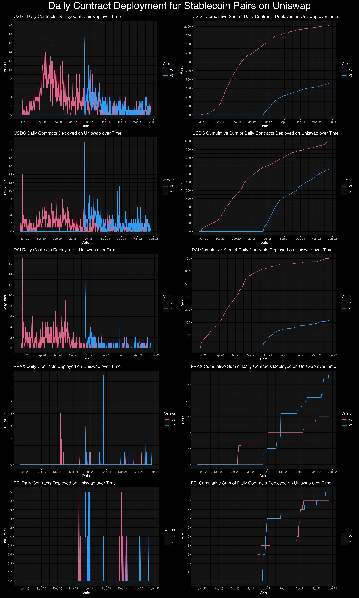

# Unigrants Community Analytics Bounty #10

As we all know, stablecoins represent one of the most important innovations in the cryptocurrency eco-system. As the growth of these *mostly* non-volatile pegged assets continues it is becoming increasingly clear that not all stables are born equal.  There are algorithmic stablecoin, asset backed stablecoins, and other forthcoming stablecoins with novel schemes that seek to provide a hedge against swings in the crypto market. 
For this bounty, we provide a way of visualizing stablecoin adoption within the Uniswap platform by analyzing the number of tokens paired with them. Our most interesting findings are:
1.	USDT, USDC, DAI, FRAX and FEI USD are the most utilized stablecoins on Uniswap.
2.	While the number of stablecoin based pairs has faster growth on Uniswap v3, Uniswap v2 is still being utilized and still contains the larger share of stablecoin paired tokens. 
3.	In an average week, there are about 5 stablecoin pairs created.  As the most adopted stable on Uniswap, there are roughly 2 USDT pairs created per day.

