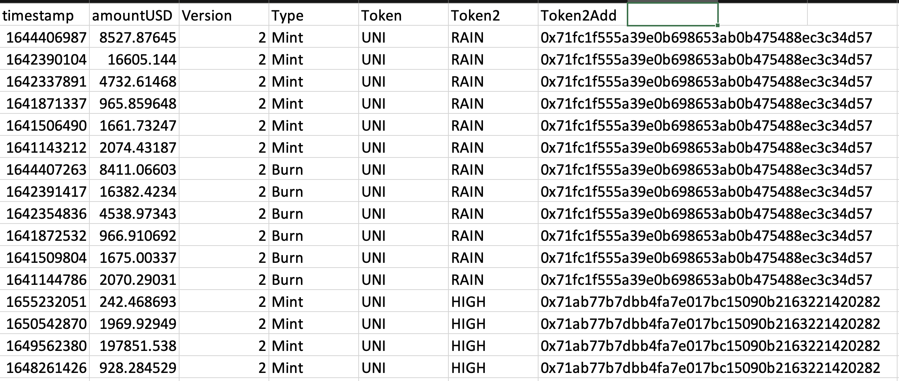
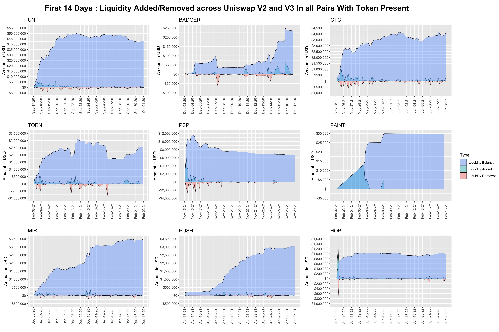

# Unigrants Community Analytics Bounty #13

## Objective

For this bounty we chose to analyze the liquidity provision patterns of Uniswap market makers during the first two weeks after an airdrop.  The 9 airdropped tokens of interest are Uniswap ($UNI), Badger DAO ($BADGER), Tornado Cash ($TORN), ParaSwap ($PSP), MurALL ($PAINT), Mirror Protocol ($MIR), Ethereum Push Notification Service ($PUSH), and Hop Protocol ($HOP).  This analysis will use statistical graphics to compare and contrast trends in liquidity provider behavior across the first two weeks of some of the eco-systems' most popular airdrops.

## Data

Using the `uniswappeR` package, we called the **get_liq_data** function to extract data for each of the 9 tokens across both the v2 and v3 Uniswap pools. Looping through and saving the results, we compiled the `liq_burns.RDS` dataset.  This data is a list of time series dataframes, which each contain 7 columns, and in total comprise 117,524 rows. A preview of the data is shown below:

## Analysis

From here, we binded together the data around each token to create area plots that track the amount of liquidity added and removed over time.  To follow up, we produced cumulative area plots that show the total amount of liquidity of each. The areas are colored by whether, at the particular time points, the liquidity for each of the nine tokens was positive. Added liquidity is shown in green, while removed liquidity is shown in bed. The overall blue area comprises the total liquidity balance as a function of time.

## Results

We see that the trend in liquidity added/removed over time is highly dependent on the token. For example, $PSP shows a significant amount of added/removed liquidity at the beginning, with this leveling out significantly later on. This stands in contrast to, for example, $BADGER, which showed the largest amount of added/removed liquidity towards the end of the two week period. As a general rule, across the nine tokens, liquidity was added more frequently than removed, and that has yielded positive liquidity balances across the board.

## Conclusion

Ultimately, our foray into this data yielded some interesting findings about how the liquidity distributions have varied across the nine tokens. But, it immediately becomes clear that there is much more we could do. For one, this analysis could be expanded beyond the tokens from this, and potentially an API could be deployed to allow a similar dataset and chart to be generated for the token of one's choosing. In addition, the time frame need not be restricted to this two week period, and could be expanded far beyond. Lastly, the liquidity could also be compared to each token's overall Market Capitalization, to give even more insight into the token's performance and how it has behaved on the Uniswap platform.
