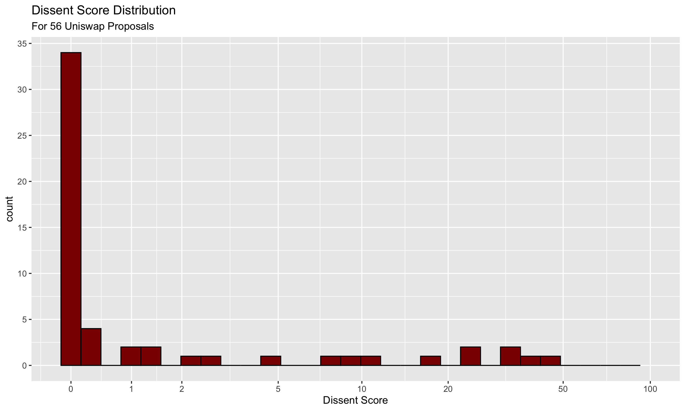

# Unigrants Community Analytics Bounty #14

## Objective

For this bounty we are opting to "dip our toes" into the messy world of blockchain governance. Our question of interest is, "Can we visualize and quantify the degree of contentiousness of Uniswap proposals?' If it is possible, we'd like to use the derived statistics and graphs to provide initial insights into how contentious uniswap proposals are, and along with that, how cohesively the community views these proposals.

## Data

Our team created a specialized set of scrapers that pull all active and closed governance proposals listed on snapshot.page. The data is shown in the screenshot below. The key fields are the `choices` and `scores` field, which when combined, allow us to compute metrics on consensus and dissent. In total, the data covers 56 proposals, and includes 16 columns of attributes about those proposals.

## Analysis and Results

We performed a data cleaning routine on this data. The key aspect of this cleaning is the parsing of the `choices` and `scores` column. Unlike traditional normal forms for data, multiple choices (and the scores for each choice) are encoded within individual rows. This meant that we had to perform a data cleaning routine where we **separate** out the individual components. We used `R` and `dplyr` to accomplish this.

In doing so, we encountered one issue - because the data itself was encoded such that the choices and scores are separated with the `;` character, one proposal presented a challenge - one of the choices actually used a `;` character within the choice text. This meant that the automated routine saw an additional choice option that wasn't in the original data. Once we special-cased this particular issue, we achieved a clean form for the data.

The clean form of the data allowed us to generate the *dissent score*. Roughly speaking, the dissent score is computed as the sum of the scores of the least-common choices divided by the overall sum of the scores. For example, if a proposal has the choices:

No/Yes

With the scores:

2/3

The dissent score is 2 / 5 = .4, implying a 40% dissent rate. But note that, likewise, if the voting distribution was 3 Nos and 2 Yeses, this would also yield a 40% dissent score.

We computed these metrics for every proposal out of the 56 in the dataset. Doing so yielded the following distribution:

We ended up placing this on a pseudo-logscale, to help highly the distribution despite the fact that most of the dissent scores tend towards zero. But ultimately, that was the conclusion we discovered! It turns out, voting isn't all that contentious after-all! Though the proposals themselves may sometimes be controversial, or even [tongue-in-cheek](https://snapshot.org/#/uniswap/proposal/QmTj8EWNTTinpDa9aXZdVkhzPBXD2monu6ZFV1dfoojR2f), voting distributions suggest that most people tend to vote the same way. Though of course, certain proposals this does not hold, with some achieving a 50% dissent rate! With that in mind, maybe the better view of the data is a Consensus rate instead:

## Conclusion: 

[Rehash eveything quickly] and [include possible extensions of this analysis...ie Strength of association calculations so show which 1-gram and 2-grams are more highly correlated with a proposal passing or being rejected, extended wallet analysis to see if wallets with higher wallet balalnces have their proposals passed at a higher rate than low wallet balances, investiage for "instigators" people who vote counter to the general consensus on multiple proposals, cluser analysis to find groups of wallets that vote on the same proposals in the same way] (edited) 