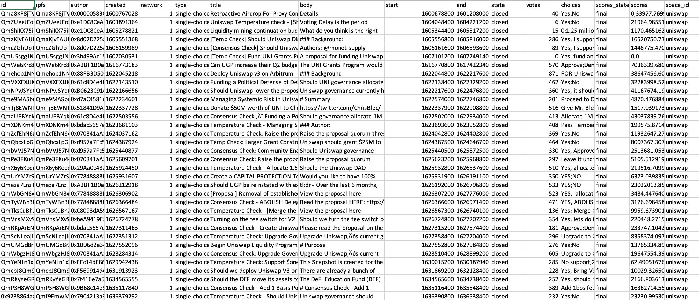
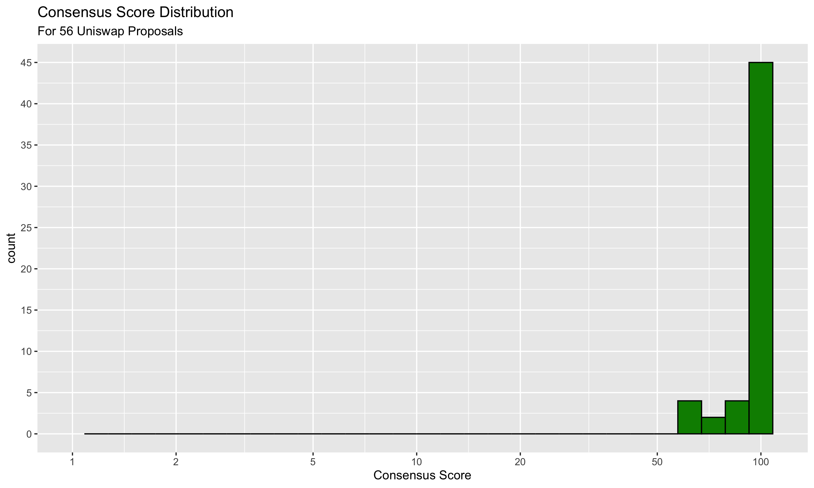

# Unigrants Community Analytics Bounty #14

## Objective

For this bounty we are opting to "dip our toes" into the messy world of blockchain governance. Our question of interest is "Can we visualize and quantify the degree of contentiousness of Uniswap proposals?” If it is possible, we'd like to use the derived statistics and graphs to provide initial insights into how we might understand cohesion and dissent within the decentralized Uniswap community. 

## Data

Our team created a specialized set of scrapers that pulled all active and closed governance proposals listed under Uniswap’s space on snapshot.page. Below is a screen capture of the data that show its comma separated structure. In total, the data covers 56 proposals, and includes 16 columns of attributes about those governance articles seeking ratification. For our analysis, the key fields are the `choices` and `scores`  which, when combined, allow us to compute metrics on consensus and dissent.

## Analysis and Results

To initiate this analysis, we performed a data cleaning routine on this data to parse and remove special characters. The key aspect of this cleaning was the parsing of the choices and scores columns. Unlike traditional normal forms for data, multiple choices (and the scores for each choice) are encoded within individual rows. This meant that we had to separate out the individual components using string splitting routines. We used R and dplyr to accomplish this.  In doing so, we encountered one additional issue. Since the data itself was encoded such that the choices and scores are separated with the ";" character, one proposal presented a special challenge because within its choices it to a ";" character. This meant that the automated routine saw an additional choice option that wasn't in the original data. Once we special-cased this particular issue, we achieved a clean form for the data.  This afforded us the chance to create our first visualization characterizing Uniswap voter consensus.

No/Yes

With the scores:

2/3

The dissent score is 2 / 5 = .4, implying a 40% dissent rate. But note that, likewise, if the voting distribution was 3 Nos and 2 Yeses, this would also yield a 40% dissent score.

We computed these metrics for every proposal out of the 56 in the dataset. Doing so yielded the following distribution:

We ended up placing this on a pseudo-logscale, to help highly the distribution despite the fact that most of the dissent scores tend towards zero. But ultimately, that was the conclusion we discovered! It turns out, voting isn't all that contentious after-all! Though the proposals themselves may sometimes be controversial, or even [tongue-in-cheek](https://snapshot.org/#/uniswap/proposal/QmTj8EWNTTinpDa9aXZdVkhzPBXD2monu6ZFV1dfoojR2f), voting distributions suggest that most people tend to vote the same way. Though of course, certain proposals this does not hold, with some achieving a 50% dissent rate! With that in mind, maybe the better view of the data is a Consensus rate instead:

## Conclusion

Ultimately, we found that there is little dissent in terms of the voting results across the 56 analyzed proposals. With that said, however, our results immediately suggested some further possible extensions. For instance, a Strength of Association analysis showing which 1-grams and 2-grams are most highly correlated with proposals being passed or rejected could provide some insight onto the types of proposals that have the most success. Likewise, analyzing wallet balances to determine if there is a correlation between wallet balance and proposals being passed could be illuminating. Finally, an investigation into whether there are particular "instigators" which tend to vote against the consensus could highly some trolls within the community.
